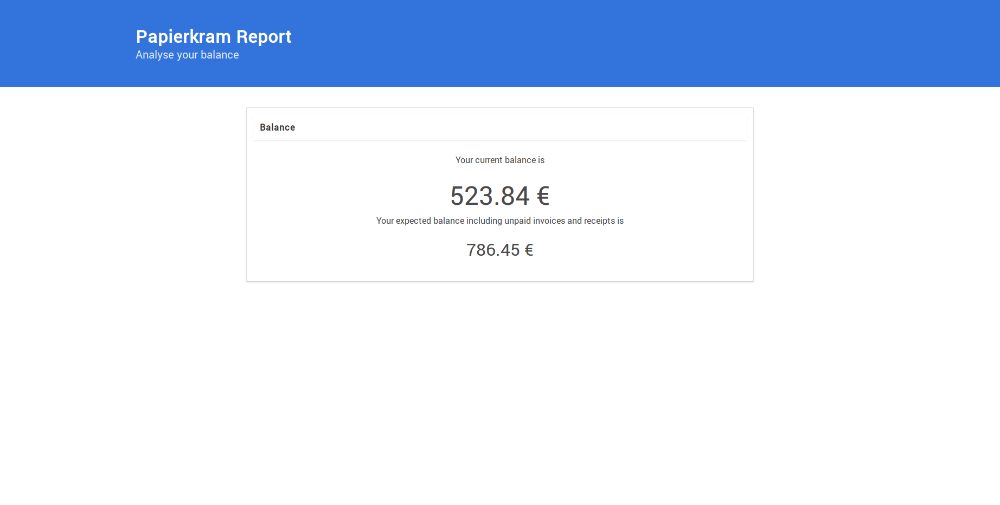

# Papierkram Report

Papierkram Report lets you analyse your balance from [Papierkram](https://papierkram.de) on a dashboard.



## Usage

```
./papierkram-report --filepath=export.zip
```

### Flags

- `--filepath`: ZIP-File exported from [papierkram.de](https://papierkram.de)
- `--port`: Port for webserver (default: 8181)

## Development

```
go-bindata -o=assets.go --nocompress --nometadata --pkg=main static/...
go build
./papierkram-report
```

## Made with

- [Bulma](https://bulma.io) - CSS framework

## Meta

Lucas Hild - [https://lucas-hild.de](https://lucas-hild.de)  
This project is licensed under the MIT License - see the LICENSE file for details